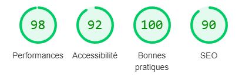
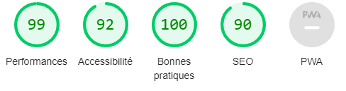

# TP7 - Conception d'application Web 

Toutes les mesures qui suivent ont été réaliser avec l'utilisation d'un ordinateur personnel connécter au réseau de l'université avec un VPN.

## 1. Analyse de l'état initial de votre application

* Mesure du temps de chargement de la page HTML initiale :

```js
// Temps de la requêtes HTTP
function getHTTPRequestTime() {
    if (window.performance && window.performance.timing) {
        const timing = window.performance.timing;
        
        if ('requestStart' in timing && 'responseEnd' in timing) {
            const getHTTPTime = timing.responseEnd - timing.requestStart;
            console.log("Temps de recuperation de la page HTML : ", getHTTPTime, " ms");
        } else {
            console.log("Les proprietes requestStart et responseEnd n'existent pas");
        }
    } else {
        console.log("L'API de navigation timing ne fonctionne pas sur ce navigateur.");
    }
}
```

* Mesure du temps d'affichage de l'app shell :

```js
function getAppShellLoadTime() {
    // Nous pouvons prendre comme ressources l'image qui suit comme dernière ressource chargée dans l'app shell.
    // Minimum HTML + CSS + JS to powering a user interface
    const lastNeededScript = 'https://cdn.jsdelivr.net/npm/handlebars@latest/dist/handlebars.js';
    
    if (window.performance && window.performance.getEntriesByType) {
        const resourceEntries = performance.getEntriesByType('resource');
        const filteredScriptEntries = resourceEntries.filter(entry => { 
            return entry.initiatorType === 'script' && entry.entryType === 'resource' && entry.name === lastNeededScript;
        });
        if (filteredScriptEntries.length > 0) {
            const scriptEntry = filteredScriptEntries[0];
            const requestStartTime = performance.timing.requestStart;
            const appShellLoadTime = (scriptEntry.responseEnd - requestStartTime) + performance.timeOrigin;
            
            console.log("L'estimation du temps de chargement de l'app shell ;", appShellLoadTime, " ms");
            
            return appShellLoadTime;
        } else {
            console.log("La ressource n'a pas été trouvée !");
        }
    } else {
        console.error("L'API de navigation timing ne fonctionne pas sur ce navigateur.");
    }
    return null;
}
```

* Mesure du temps d'affichage du chemin critique de rendu (CRP) :

```js
// Le temps de chargement du CRP. Ce temps est éstimé car il se base sur la dernière ressource supposément charger pour le CRP.
function getCRPLoadTime() {
    // const lastNeededScript = 'https://192.168.75.58/api/client/js/bootstrap.js'; premier version quand boostrape n'étais pas inclue via la CDN
    const lastNeededScript = 'https://cdn.jsdelivr.net/npm/bootstrap-4@4.0.0/index.min.js';
    if (window.performance && window.performance.getEntriesByType) {
        const resourceEntries = performance.getEntriesByType('resource');
        const filteredScriptEntries = resourceEntries.filter(entry => {
            return entry.initiatorType === 'script' && entry.entryType === 'resource' && entry.name === lastNeededScript;
        });
        if (filteredScriptEntries.length > 0) {
            const scriptEntry = filteredScriptEntries[0];
            const requestStartTime = performance.timing.requestStart;
            const CRPLoadTime = (scriptEntry.responseEnd - requestStartTime) + performance.timeOrigin;
        
            console.log("L'estimation du temps de chargement du CRP ;", CRPLoadTime , " ms");
            
            return CRPLoadTime;
        } else {
            console.log("La ressource n'a pas été trouvée !");
        }
    } else {
        console.error("L'API de navigation timing ne fonctionne pas sur ce navigateur.");
    }
    return null;
}
```

#### Mesures initials - Déploiement sur Tomcat :

|                        | Chargement page HTML initial | Affichage de l'app shell | Affichage du CRP | 
|------------------------|------------------------------|--------------------------|------------------|
| Temps en millisecondes |             25ms             |           285ms          |       391ms      |

## 2. Déploiement des fichiers statiques sur *Nginx*

#### Etapes d'optimisation en déployant la SPA sur *Nginx* :

1. Copie des fichiers de notre SPA (ci-dessous) dans le répertoir **/usr/share/nginx/spa/**

```
.
├── css
│   ├── app.css
│   ├── bootstrap.css
│   └── bootstrap.min.css
├── index.html
└── js
    ├── api-base.js
    ├── bootstrap.js
    ├── bootstrap.min.js
    ├── spa.js
    └── vendor
        ├── jquery.js
        ├── popper.min.js
        └── what-input.js
```

2. Mise à jour de la configuration Nginx

```
location / {
        root /usr/share/nginx/spa;
        try_files $uri $uri/ /index.html;  # premet de s'assurer que les requêtes sont bien redirigées vers index.html (SPA)
}
```

3. Redémarage du service *Nginx*


#### Déploiement sur nginx et amélioration :

|                        | Chargement page HTML initial | Affichage de l'app shell | Affichage du CRP | 
|------------------------|------------------------------|--------------------------|------------------|
| Temps en millisecondes |             22ms             |           120ms          |       198ms      |
|    **Amélioration**    |             12%              |            57%           |        49%       |


## 3. Optimisation de votre application

<center>

<figcaption>Résultat du le première évaluation de performance de notre client via l'outil Ligthhouse du DevTools Chrome.</figcaption>
</center>

### Utilisation de CDN 

* Ajoute du CDN pour :
  * jQuery
  * bootstrap
  * popper.min.js
  * what-input.min.js

Cela permet par le même occasion de supprimer les anciennes importation en local.

|                        | Chargement page HTML initial | Affichage de l'app shell | Affichage du CRP | 
|------------------------|------------------------------|--------------------------|------------------|
| Temps en millisecondes |             22ms             |           102ms          |       104ms      |
|    **Amélioration**    |             12%              |            15%           |        47%       |


### Chargement de l'image en décalé

Notre dernière optimisation consiste à ajouter la méthode de chargement "lazy" à l'image présent de le *footer* de notre site.
Cela permet de décaler le chargement jusqu'au moment où elle doit être affichée.

Comme le montre cette image ci-dessous ces modifications nous, on permit d'atteindre un score de **99** en performance.Comme le montre cette image ci-dessous ces modifications nous, on permit d'atteindre un score de **99** en performance.

<center>

<figcaption>Résultat du le première évaluation de performance de notre client via l'outil Ligthhouse du DevTools Chrome.</figcaption>
</center>
